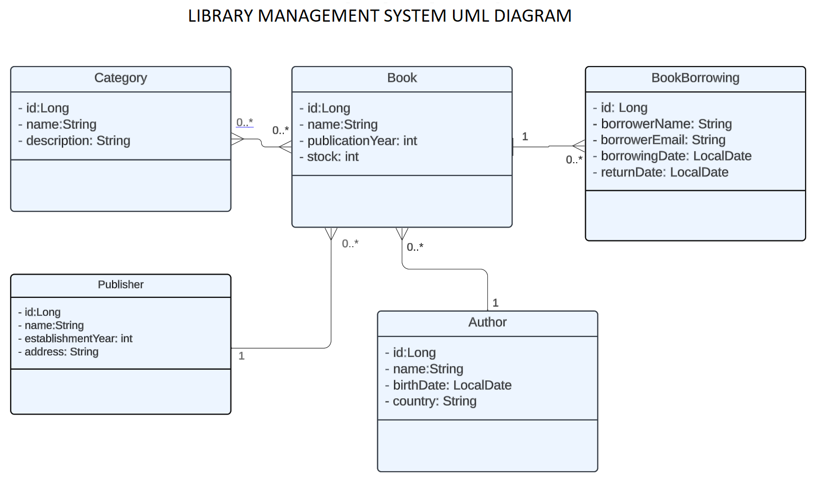

# LIBRARY MANAGEMENT SYSTEM

This is a REST API project developed for the usage of libraries.
It enables operations such as managing records, borrowing and returning books.

## Technologies Used

<code></code>
<code></code>
<code></code>
<code></code>
<code></code>
<code></code>
<code></code>
<code></code>
<code></code>

## Features

- Adding, updating, and deleting authors, categories, and publishers are supported.
- Stock information of books is maintained.
- Records of borrowing and returning books are kept.

## UML Diagram

## API Usage

Below is a list of fundamental endpoints provided by the API:

| Endpoint                   | HTTP Method | Explanation                                       |
|----------------------------|:------------|---------------------------------------------------|
| **author**                 |             |                                                   |
| `/api/v1/authors/{id}`     | GET         | Gets the author with the specified ID.            |
| `/api/v1/authors/{id}`     | PUT         | Updates the author with the specified ID.         |
| `/api/v1/authors/{id}`     | DELETE      | Deletes the author with the specified ID.         |
| `/api/v1/authors`          | GET         | Gets all Authors                                  |
| `/api/v1/authors`          | POST        | Adds Author                                       |
|                            |             |                                                   |
| **publisher**              |             |                                                   |
| `/api/v1/publishers/{id}`  | GET         | Gets the publisher with the specified ID.         |
| `/api/v1/publisher/{id}`   | PUT         | Updates the publisher with the specified ID.      |
| `/api/v1/publisher/{id}`   | DELETE      | Deletes the publisher with the specified ID.      |
| `/api/v1/publisher`        | GET         | Gets all Publishers                               |
| `/api/v1/publisher`        | POST        | Adds Publisher                                    |
|                            |             |                                                   |
| **category**               |             |                                                   |
| `/api/v1/categories/{id}`  | GET         | Gets the category with the specified ID.          |
| `/api/v1/categories/{id}`  | PUT         | Updates the category with the specified ID.       |
| `/api/v1/categories/{id}`  | DELETE      | Deletes the category with the specified ID.r      |
| `/api/v1/categories`       | GET         | Gets all categories                               |
| `/api/v1/categories`       | POST        | Adds category                                     |
|                            |             |                                                   |
| **book**                   |             |                                                   |
| `/api/v1/books/{id}`       | GET         | Gets the book with the specified ID.              |
| `/api/v1/books/{id}`       | PUT         | Updates the book with the specified ID.           |
| `/api/v1/books/{id}`       | DELETE      | Deletes the book with the specified ID.           |
| `/api/v1/books`            | GET         | Gets all books                                    |
| `/api/v1/books`            | POST        | Adds book                                         |
|                            |             |                                                   |
| **book borrowing**         |             |                                                   |
| `/api/v1/borrows/{id}`     | GET         | Gets the book borrowing with the specified ID.    |
| `/api/v1/borrows/{id}`     | PUT         | Updates the book borrowing with the specified ID. |
| `/api/v1/borrows/{id}`     | DELETE      | Deletes the book borrowing with the specified ID. |
| `/api/v1/borrows`          | GET         | Gets all book borrowings.                         |
| `/api/v1/borrows`          | POST        | Adds book borrowing.                              |

## Installation

1. Clone project. 
   - git clone
2. Configure the database in the `src/main/resources/application.properties` file.
3. To start the project, launch it from your IDE.
4. You can use the API and send requests to the endpoints by using Postman with http://localhost:8080/ URL.

## Environment Variables

To run this project, you need to update the following environment variables in the `application.properties` file.

- spring.datasource.url  
- spring.datasource.username  
- spring.datasource.password

## Contributing

Contributions are welcome! If you find any issues or have suggestions for improvement, please submit a pull request or open an issue.

## LICENSE

[MIT](https://choosealicense.com/licenses/mit/)